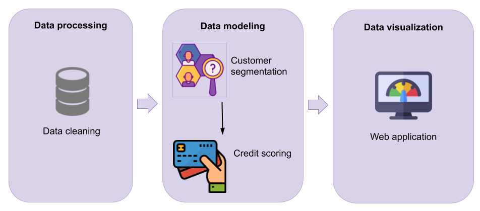

# Pymes-Neuronales

El siguiente proyecto es un modelo de segmentación de clientes, usando KMeans, y clasificación a crédito bancario, usando Redes Neuronales.

El procedimiento seguido en el proyecto tiene los siguientes pasos:

## Contenido

1. Data cleaning: Script para limpiar los datos proveídos por una entidad bancaria.
2. Data modeling: Desarrollo del modelo de **clustering** que permite segmentar a los clientes, para luego pasar a un modelo de clasificación, basado en **redes neuronales**, para conocer si el cliente es o no apto para un préstamo.
3. Data visualization: Aplicación web que consume el modelo ya entrenado y muestra si el cliente aprueba o no a un crédito a partir de ingresar su información financiera.

